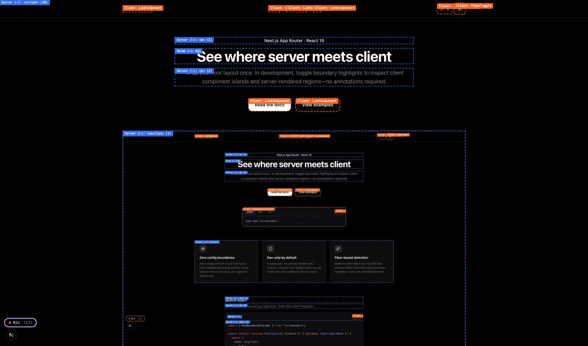

# RSC Boundary

**See where Server Components end and Client Components begin**—directly in the browser, on your real app.

RSC Boundary is a lightweight devtool for **Next.js App Router** apps. Add one provider to your root layout and you get outlines, labels, and a panel that map **server-rendered regions** vs **client subtrees**—no annotations on every file, no guessing from the file tree alone.

The published package is [`rsc-boundary`](packages/rsc-boundary). This repo also ships a **demo, docs snippets, and playground** in [`apps/web`](apps/web).



## Why use it

- **Make the RSC mental model concrete.** Server Components have no client fibers; Client Components hydrate. That split is easy to lose when you’re deep in JSX—this tool surfaces it on the page you’re building.
- **Onboard and review faster.** Spot accidental client boundaries, nested server islands, and where interactivity actually lives without spelunking through `"use client"` directives.
- **Zero ceremony in production.** In production builds the provider is a pass-through: no extra DOM, no runtime cost. Turn highlights on only when you want them (dev by default; optional `enabled` for deployed demos).

## What you get (dev mode)

- **Orange** dashed outlines around client component roots (`"use client"`).
- **Blue** dashed outlines around server regions (heuristic detection, plus optional explicit markers when you need precision).
- **Labels** and a **panel** with component names and provenance—so you can correlate the UI with your source.

For behavior details, optional APIs (`RscDevtools`, explicit server markers), architecture, and limitations, read **[`packages/rsc-boundary/README.md`](packages/rsc-boundary/README.md)**.

## Install in your Next.js app

**Requirements:** Next.js **16+** (App Router), React **19+**.

```bash
pnpm add rsc-boundary
# or: npm install rsc-boundary
# or: yarn add rsc-boundary
```

Wrap `children` in your **root** `app/layout.tsx` (or `src/app/layout.tsx`):

```tsx
import { RscBoundaryProvider } from "rsc-boundary";

export default function RootLayout({
  children,
}: {
  children: React.ReactNode;
}) {
  return (
    <html lang="en">
      <body>
        <RscBoundaryProvider>{children}</RscBoundaryProvider>
      </body>
    </html>
  );
}
```

You do not need to change other components. A small control appears in development to toggle highlights. For devtools on a deployed site (like this repo’s demo), pass `enabled` on `RscBoundaryProvider`.

### Agent skill (`install`)

This repo includes a coding-agent skill that walks through the same integration steps; it lives at [`skills/install`](skills/install). Add it with **skills.sh** or:

```bash
npx skills add foxted/boundary --skill install
```

## Contributing to this monorepo

Layout, local dev, and where to put changes: **[`CONTRIBUTING.md`](CONTRIBUTING.md)** and [`AGENTS.md`](AGENTS.md).

## Releases

Versioning and publishing use [Changesets](https://github.com/changesets/changesets). From the repo root:

```bash
pnpm changeset        # describe changes
pnpm version-packages # bump versions from changesets
pnpm release          # build package and publish (maintainers)
```

## License

See [LICENSE](LICENSE). The `rsc-boundary` package includes its own [LICENSE](packages/rsc-boundary/LICENSE).
